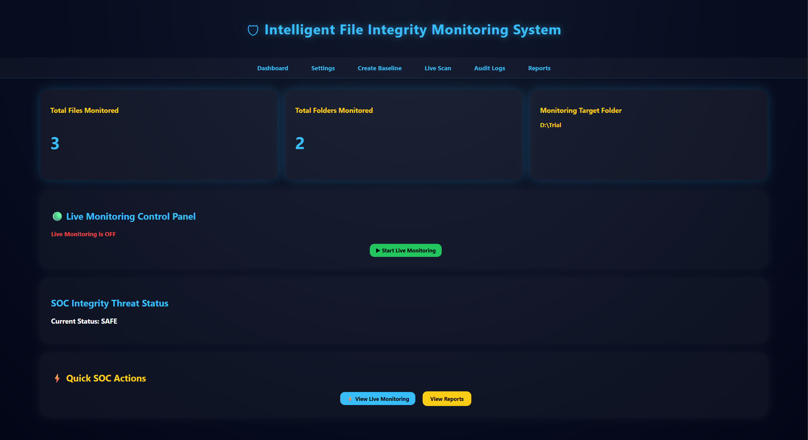
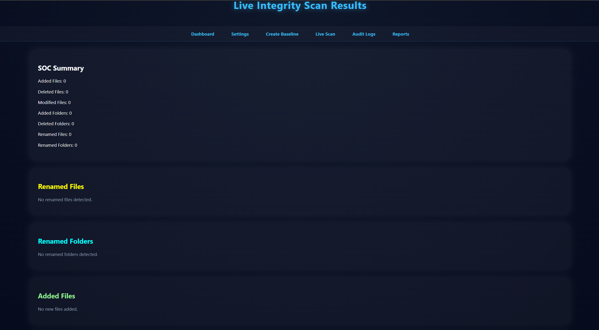
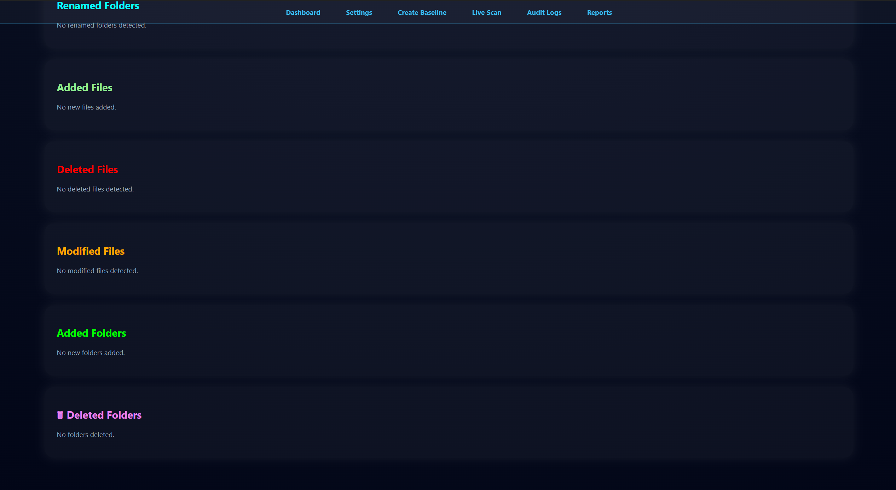
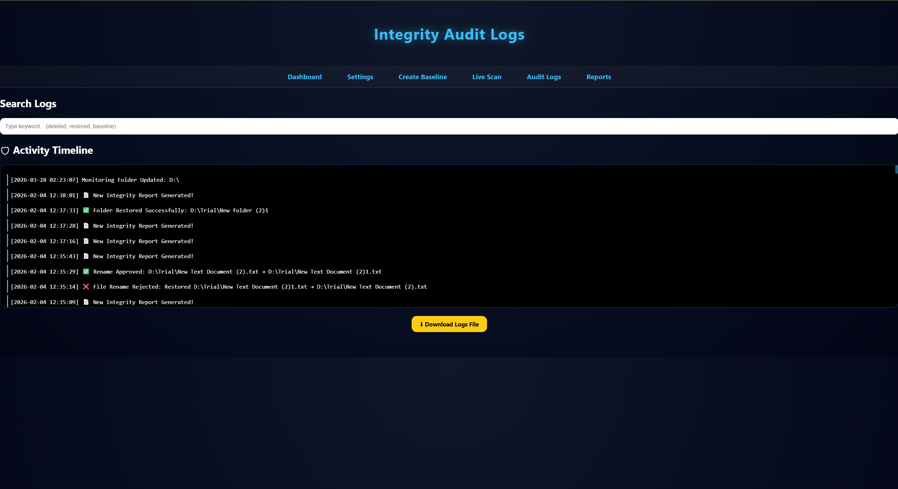
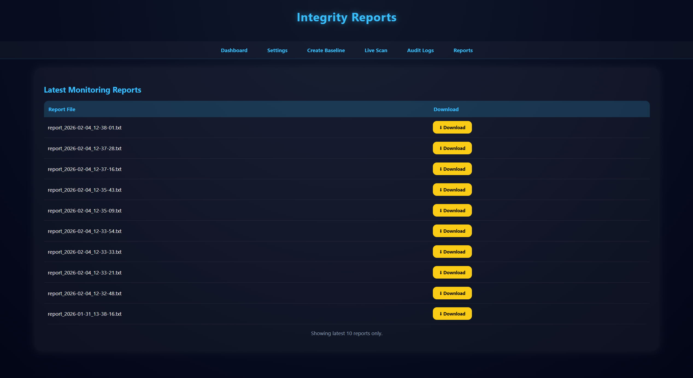
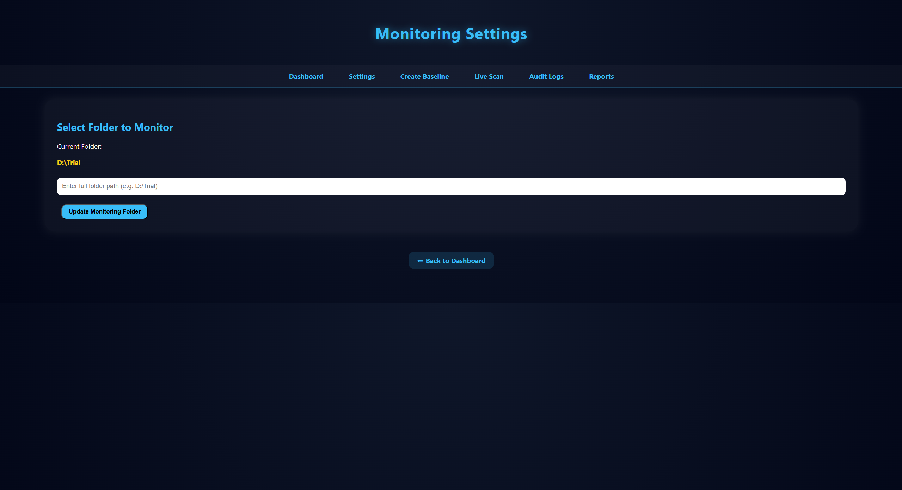
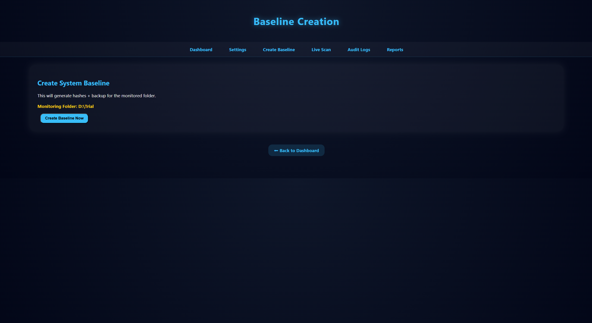

# File Monitoring Software

A Python-based file integrity monitoring system that tracks changes, generates reports, and provides a web dashboard.

---

##  Dashboard Preview

  

---

##  Live Monitoring

  

  

---

##  Audit Logs

  

---

##  Reports

  

---

##  Settings

  

---

##  Baseline Creation

  

---

## Features

- File change detection using hashing  
- Baseline comparison system  
- Backup management  
- Report generation  
- Web dashboard interface  

---

## Tech Stack

- Python  
- Flask  
- JSON  

---

## How to Run

``bash

python web_dashboard.py

Then open: http://127.0.0.1:5000/

## Future Improvements

Real-time alerts

Email notifications

Database integration
